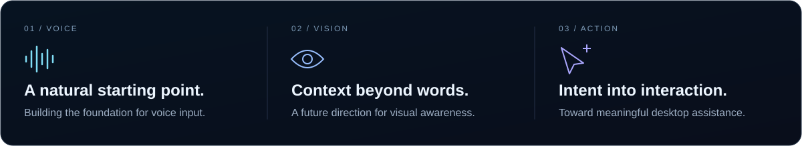

  <picture>
    <source media="(prefers-reduced-motion: reduce)" srcset="assets/brand/hero-still.webp">
    
  </picture>

<h1 align="center">Intelligence, within reach.</h1>

  An open-source AI desktop agent by <strong>Kailarin</strong>. 
  Working toward a more natural connection between you and your computer.

  <a href="#mission">Mission</a> &nbsp; / &nbsp;
  <a href="#development-roadmap">Roadmap</a> &nbsp; / &nbsp;
  <a href="docs/architecture/v1-voice-core-analysis.md">Architecture</a> &nbsp; / &nbsp;
  <a href="#contribute">Contribute</a>

  <strong>B1 · Early development</strong> &nbsp; · &nbsp; MIT licensed &nbsp; · &nbsp; Built in the open

---

## Mission

KYRIN is being developed to connect **voice, vision, and text** with meaningful interaction on the desktop. Our ambition is an agent that can understand what you need and help you work with your computer naturally.

The journey begins with a focused foundation: **reliable voice input**. The wider desktop-agent experience is our direction, with capabilities introduced and validated in stages.

  

## Development roadmap

| Stage | Focus | Status |
| :--- | :--- | :--- |
| **01 / Foundation** | Voice input, audio capture, and a replaceable speech-to-text boundary | **Current focus** |
| **02 / Perception** | Visual understanding and richer desktop context | Planned |
| **03 / Interaction** | Desktop automation and command execution | Planned |
| **04 / Reach** | Cross-platform support | Planned |

These stages describe the intended direction, not a list of released capabilities. KYRIN is in early development; this repository currently publishes the project overview and architecture requirements.

## Engineering the foundation

The V1 Voice Core is scoped to microphone input and transcription. Its design keeps audio capture, speech recognition, and downstream command processing separate, so implementations can evolve without coupling the entire system to one provider.

**V1 design principles**

- **Clear boundaries.** Audio acquisition and speech recognition have distinct responsibilities.
- **Replaceable providers.** Higher-level code receives provider-independent results.
- **Controlled failures.** Microphone and recognition errors should allow a safe, manual retry.
- **Focused scope.** Desktop actions belong to later layers of the agent.

Read the [V1 Voice Core requirements](docs/architecture/v1-voice-core-analysis.md) for scope, failure scenarios, and acceptance criteria.

## Contribute

Thoughtful architecture feedback, clear problem reports, and focused proposals are welcome.

1. Read the [current requirements](docs/architecture/v1-voice-core-analysis.md).
2. [Open an issue](https://github.com/mohammadhosseinzakeri10/kyrin/issues) to describe a problem or discuss a proposed change.
3. Keep contributions small and aligned with the current development stage.

Please use **English** for public documentation, issues, and pull requests so the project remains accessible to an international community.

## License

KYRIN is released under the [MIT License](LICENSE).

---

  <strong>KYRIN</strong> &nbsp; · &nbsp; by <strong>Kailarin</strong> 
  Voice. Vision. Possibility. 
  <a href="assets/brand/hero-still.webp">View the still artwork</a>

